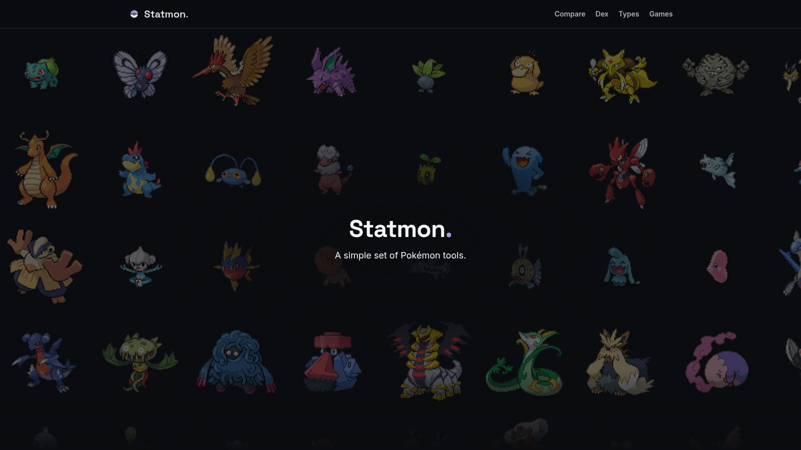
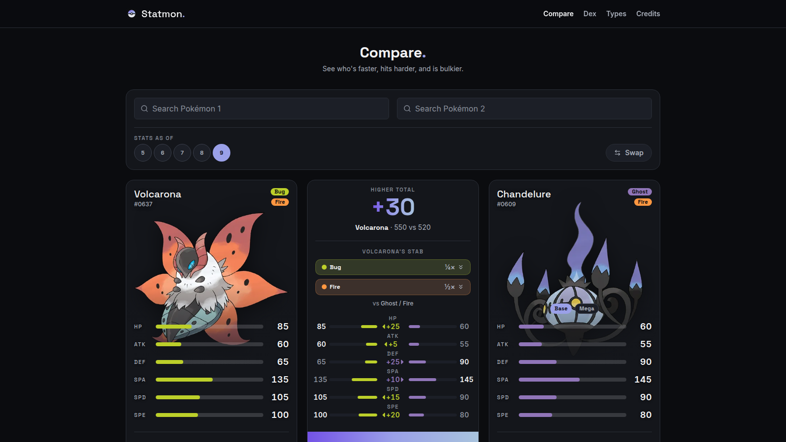
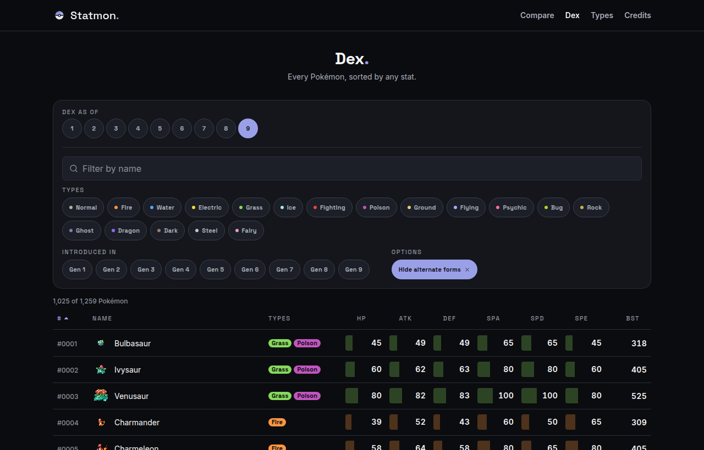
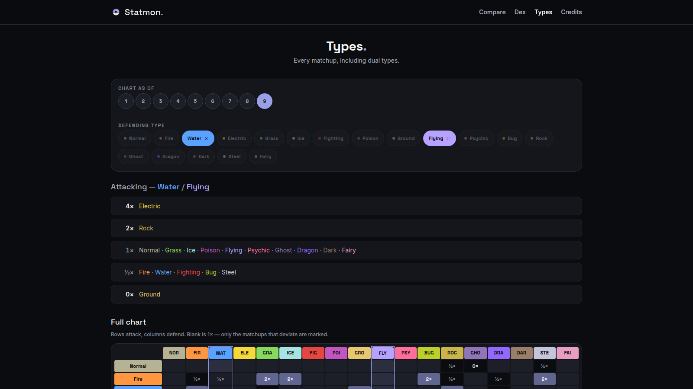
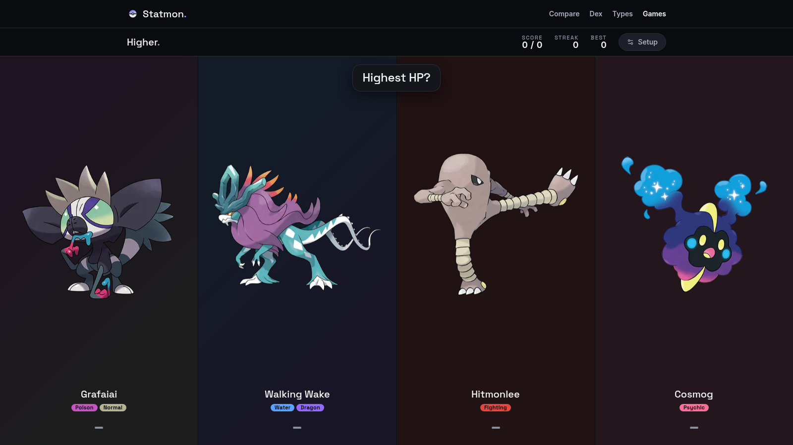
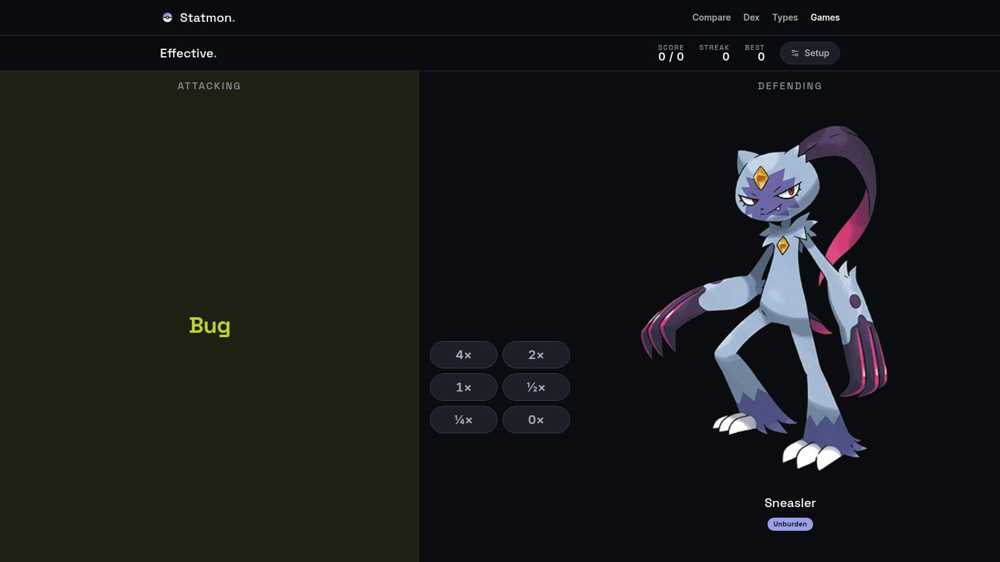

# Statmon

Pokémon reference tools, built for myself: a side-by-side stat comparison, the whole dex in one sortable table, and a type chart that handles dual types. Each can be read as of any generation, with that generation's stats, typings, and type chart. Two games use the same data to quiz you instead.

**Live at [statmon.noahpn.dev](https://statmon.noahpn.dev/).** The [About](https://statmon.noahpn.dev/about) page says more about why it exists.



## Why

Sometimes I go on a nostalgia trip and play a ton of old childhood games. One summer that turned into playing every mainline Pokémon game end to end, Generation 1 through 5. Every playthrough, I'd hit a fork in the road where I had to pick between two Pokémon, and what mattered most to me was speed and attack. The sites I found for comparing them either looked a little outdated or were cluttered with features I didn't need. So I built a lighter version of my own: minimal, quick, and clear.

Playing the old games again also turned up something the site was quietly getting wrong. Generation 1 has no Sp. Attack or Sp. Defense: one Special stat covers both. Plenty of Pokémon have had their stats or typing changed since, too. So every tool can now be read as of an earlier generation, with the numbers that were actually in the game then.

## The tools

- **[Compare](https://statmon.noahpn.dev/compare):** two Pokémon's base stats side by side, with the type matchup between them, their abilities, and a straight answer about who moves first.
- **[Dex](https://statmon.noahpn.dev/dex):** all 1,259 entries in one table, sortable by any stat and filterable by type and generation. The sort and filters live in the URL, so a view is a link you can send someone.
- **[Types](https://statmon.noahpn.dev/types):** the full effectiveness chart. Pick up to two types and the 18 attacking types sort themselves into tiers, with the full grid still underneath. You can also search a Pokémon instead of its types, so "what beats Corviknight" works without looking up that it's Steel/Flying.
- **Any generation:** Compare offers every generation both Pokémon existed in, with a dot on each one where the board differs from today's. The dex becomes the dex as it was: Gen 3 is 392 entries with their Gen 3 stats, and Gen 1 is 151 with five stats, Special included. The type chart goes back to Gen 1's 15 types, where Ghost does nothing to Psychic. The generation is in the URL like everything else.
- **Abilities:** Ground beats Electric, unless the Electric type is Eelektross, which has Levitate. Every Pokémon's abilities are on its card, and the 20 that change type effectiveness feed into the matchup. That's generation-aware too: Gengar had Levitate until Gen 7, so as of Gen 6, Ground does nothing to it.







## The games

The same data, asking the questions instead. Every round ends with a link into the tool that would have answered it.

- **[Higher](https://statmon.noahpn.dev/games/higher):** two or four Pokémon, one stat, pick the highest. The settings are the dex's own filters, so "Kanto Fire types, Speed only" is a game. It never asks a tie, or a gap too small to know: under 3 points for a stat, or 5 for a stat total. Your best streak is saved for each set of settings, and a lifetime accuracy for each stat lists your weakest first. Both stay in your browser.
- **[Effective](https://statmon.noahpn.dev/games/effective):** an attacking type against a defender, answered with the multiplier. The defender is a single type on Easy, a dual type on Medium, and a whole Pokémon on Hard, whose typing you have to remember. 204 of the 324 single-type matchups are 1×, so the game picks the answer first and then finds a question for it: on Easy, each of the four answers comes up about a quarter of the time. On Hard, the Pokémon's ability is drawn from the ones it can have. Chandelure is 0× to Fire with Flash Fire and ½× with Flame Body, so you have to read the card.





## How it works

Everything comes from [PokéAPI](https://pokeapi.co), pulled once at build time into a local JSON file. The sprites, the artwork, and both webfonts are downloaded and committed to the repo. So the site requests nothing from any other server: it's static files, and its Content Security Policy only allows its own origin. Search, the stat math, and the type matchups all run against the local data.

Two parts are written by hand. The type chart has three eras (Gen 1, Gen 2 to 5, and Gen 6 on), and every data build checks all three against PokéAPI, so a typo fails the build. The 20 ability effects are a table too, because PokéAPI describes what an ability does only in prose: Levitate's entry reads "Evades Ground moves." The build checks that each one is a real ability some Pokémon has, and unit tests cover what each one does.

It's built with React, Vite, Tailwind, React Router, and plain JavaScript, and served as static assets on Cloudflare Workers.

## Run it

Node 22 or later. From the root of the repo:

```
npm install
npm run dev
```

The dataset, sprites, and fonts are already committed, so that's all it takes. When something upstream changes, `npm run build:data` rebuilds the dataset from PokéAPI, `npm run vendor:images` fetches the sprites and artwork, and `npm run vendor:fonts` fetches the fonts with their licences.

## Checks

`npm run check` runs all nine checks, in CI's order, cheapest first:

- `lint`: ESLint.
- `format:check`: Prettier.
- `audit:classes`: no class string sets the same CSS property twice. Tailwind resolves those by stylesheet order, not by the order they're written, so the one that wins isn't the one you meant.
- `audit:styles`: every utility is one the [style guide](docs/06_style_guide.md) allows. Colours are semantic tokens, text uses the 22 named styles, and spacing, radius, opacity, and layering each come from a closed set. A value the guide doesn't list fails.
- `test:run`: 501 unit tests, covering the stat math, the dex's sorting and filters, the generation lens, the ability table, both games' question generators, a server render of every route, accessibility and copy regressions, and one implementation of each shared component.
- `build`: the production build.
- `audit:contrast`: WCAG AA contrast for every text and colour pairing, in 13 groups, including text on all 18 type tints, text on the flame gradient, and the edges of the text fields.
- `check:docs`: every link and anchor in this README and in `docs/`.
- `sweep:widths`: headless Chrome across 29 routes at 14 widths. No page may scroll sideways or show its footer on load. Every touch target has to meet WCAG 2.5.8.

On every push to `main`, GitHub Actions runs the same nine. `npm run shoot:docs` regenerates this README's screenshots from the built site.

## Limits

- **Stats, types, and abilities only.** No moves, movesets, EVs, IVs, or natures, and no damage calculator.
- **Only the 20 abilities in the table change the numbers.** Every other ability is shown on its card without affecting a matchup. Dry Skin's extra damage from Fire (1.25×) isn't modelled either, because the chart has no room for it.
- **The data is a snapshot.** It's rebuilt from PokéAPI by hand, so Pokémon released after the last build aren't in it.
- **Effective never asks for ⅛×.** A double resistance plus an ability that halves again reaches it, but only four Pokémon can: Dewgong, Spheal, Sealeo, and Walrein. The type chart still shows it.

## Docs

My working notes are in [`docs/`](docs/): the original brainstorm, the spec, the design system, and a dated log of why things are built the way they are. To see how I think through a project, start with the [decision log](docs/03_decisions.md).

## Credits

Data and images come from [PokéAPI](https://pokeapi.co), and the sprites are CC0. The two webfonts, Inter and Space Grotesk, are under the SIL Open Font License, and the carets on the comparison board and the dex are from Font Awesome Free (CC BY 4.0). Every third-party notice is in [`licenses/NOTICE.md`](licenses/NOTICE.md). `npm run vendor:fonts` fetches the font licences along with the fonts, so a re-vendor can't drop them.

Pokémon is © Nintendo, Game Freak, and The Pokémon Company. Statmon is an unofficial fan project.

## Licence

The code is MIT. See [`LICENSE`](LICENSE).
